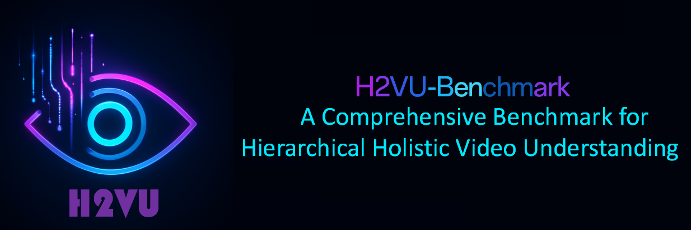
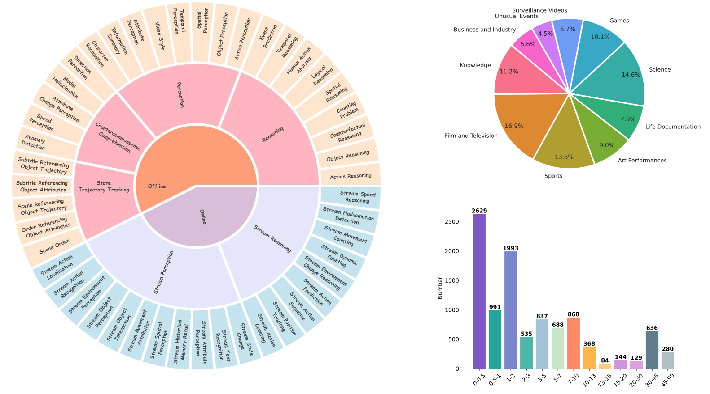
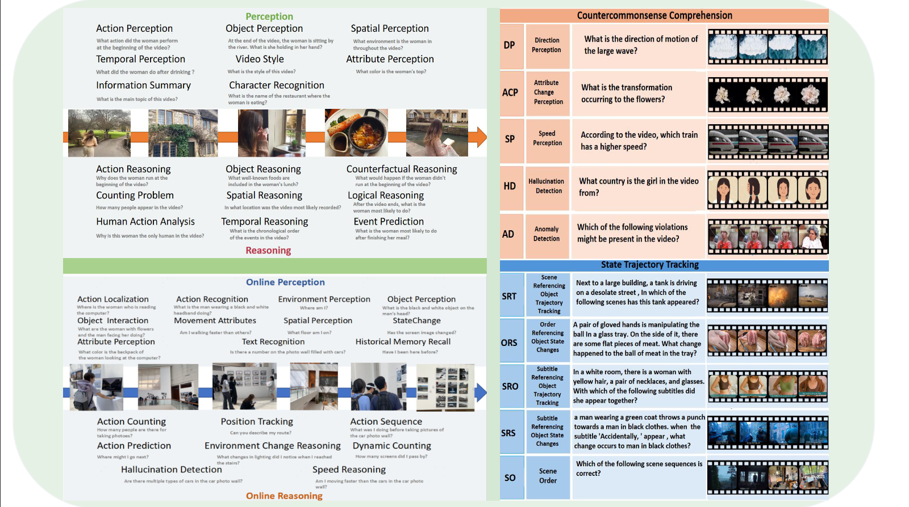

# H2VU-Benchmark: A Comprehensive Benchmark for Hierarchical Holistic Video Understanding
<div>
  Qi Wu<sup>*</sup>,
  Quanlong Zheng<sup>*</sup>,
  Yanhao Zhang<sup>†♠</sup>,
  Junlin Xie,
  Jinguo Luo,
  Kuo Wang,
  Peng Liu,
  Qingsong Xie,
  Ru Zhen,
  Zhenyu Yang,
  Haonan Lu<sup>†</sup>
 

 
</div>

 
 
  
 


<p align="center">
    
</p>


<font size=7><div align='center' >  [[📖 arXiv Paper](https://arxiv.org/abs/2503.24008)] [[📊 Dataset](https://huggingface.co/datasets/siriussa/H2VU-Benchmark)]   </div></font>

H2VU-Benchmark applies to  **video MLLMs**. 🌟

---

## 🔥 Updates News


* **`2024.04.30`** 🌟 We have open-sourced our dataset on Hugging Face.
* **`2025.04.01`** 🌟 We are very proud to launch H2VU-Benchmark, the first comprehensive evaluation benchmark for Multimodal Large Language Models (MLLMs) in offline general video and online streaming analysis!


## 👀 H²VU-Benchmark Overview


H²VU-Benchmark is designed to comprehensively assess the capabilities of video understanding models, particularly in real-world scenarios. It addresses limitations of existing benchmarks by focusing on **extended video durations, advanced task complexity, and diversified real-world data.**

## Key Features

*   **Three-Tier Hierarchical Competency Classification:** (L-1 to L-3) with **10,183 evaluation tasks** covering a broad spectrum of diverse data.
*   **Two Main Categories:**
    *   **Offline General Video:** Employs common perception and reasoning tasks, along with novel tasks focusing on **countercommonsense comprehension** and **trajectory tracking.** (27 evaluation task types)
    *   **Online Streaming Video:** Utilizes standard perception and reasoning tasks. (20 evaluation task types)

## Key Differentiators from Existing Benchmarks

Our work distinguishes itself through three key features:

*   **Extended Video Duration:**
    *   Encompasses a diverse range from a **few seconds to 1.5 hours**, significantly expanding the temporal scope.
    *   Evaluates models' ability to capture **short-term dynamics** and model **long-term dependencies.**
*   **Advanced Task Complexity:**
    *   Builds on traditional perceptual and reasoning tasks with the introduction of two new modules:
        *   **Counterfactual Reasoning:** Assesses vision-oriented understanding through tasks that defy common sense (e.g., implausible causal relationships).
        *   **Trajectory State Tracking:** Evaluates the ability to track and predict the states and trajectories of targets in complex dynamic scenes.
*   **Diversified Real-World Data:**
    *   Incorporates **first-person streaming video data** to better simulate real-world streaming data processing needs.
    *   Explores multimodal models' performance in understanding first-person streaming video, crucial for AI agents functioning as real-world assistants or autonomous agents.

<p align="center">
    
</p>

## 📐 Dataset Examples

<p align="center">
    
</p>


## 🔍 Dataset

**License**:
```
H²VU-Benchmark is only used for academic research. Commercial use in any form is prohibited.
The copyright of all videos belongs to the video owners.
If there is any infringement in H²VU-Benchmark, please email us and we will remove it immediately.
Without prior approval, you cannot distribute, publish, copy, disseminate, or modify H²VU-Benchmark in whole or in part. 
You must strictly comply with the above restrictions.
```


## 🔮 Evaluation Pipeline


📍 **Prompt**:

The common prompt used in our evaluation follows this format:

```
Select the best answer to the following multiple-choice question based on the video. Respond with only the letter (A, B, C, or D) of the correct option. 
[Question]
The best answer is:
```

📍 **Evaluation**: 

To extract the answer and calculate the scores, we add the model response to a JSON file. Here we provide an example template [output.json](./evaluation/output.json). Once you have prepared the model responses in this format, please refer to the evaluation script [eval_results.py](./evaluation/eval_results.py), and you will get the accuracy scores across video_durations, video domains, video subcategories, and task types. 
The evaluation does not introduce any third-party models, such as ChatGPT.

```bash
python eval_results.py 
```


## :black_nib: Citation

If you find our work helpful for your research, please consider citing our work.   

```bibtex
@article{2025h2vu,
  title={H2VU-Benchmark: A Comprehensive Benchmark for Hierarchical Holistic Video Understanding},
  author={Wu, Qi and Zheng, Quanlong and Zhang, Yanhao and Xie, Junlin and Luo, Jinguo and Wang, Kuo and Liu, Peng and Xie, Qingsong and Zhen, Ru and Lu, Haonan and others},
  journal={arXiv preprint arXiv:2503.24008},
  year={2025}
}
```

## 📜 Related Works

We appreciate the contributions of Related Works to our work:

-  **[MME]** [MME: A Comprehensive Evaluation Benchmark for Multimodal Large Language Models](https://arxiv.org/pdf/2306.13394)

-  **[OVO-Bench]** [OVO-Bench: How Far is Your Video-LLMs from Real-World Online Video Understanding?](https://arxiv.org/pdf/2411.15296)
-  **[VideoVista]** [VideoVista: A Versatile Benchmark for Video Understanding and Reasoning](https://arxiv.org/abs/2406.11303)
-  **[LongVideoBench]** [LongVideoBench: A Benchmark for Long-context Interleaved Video-Language Understanding](https://arxiv.org/abs/2407.15754)

